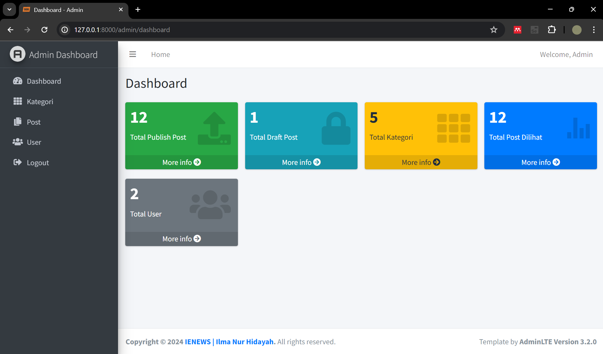

# Proyek Baca Berita dengan Laravel

Ini adalah aplikasi baca berita yang dibangun dengan Laravel. Proyek ini mendukung tiga peran utama: User, Admin, dan Pengelola.

## Deskripsi Proyek

### Peran dan Hak Akses

1. *User*: 
    - Dapat melihat dan membaca berita.

2. *Admin*: 
    - Dapat melihat dashboard dan mengetahui total publish post, total draft post, total kategori, total post dilihat, total dan user.
    - Dapat menambahkan, mengedit, dan menghapus postingan.
    - Dapat menambahkan, mengedit, dan menghapus kategori.
    - Dapat menambahkan, mengedit, dan menghapus pengguna.

3. *Pengelola*: 
    - Dapat melihat dashboard dan mengetahui total postingan, total publish post, total draft post, total kategori, total post dilihat.
    - Dapat menambahkan, mengedit, dan menghapus kategori.
    - Dapat melihat data post lebih rinci tetapi tidak bisa menambahkan postingan.
    - Tidak dapat melihat, menambahkan, mengubah, dan menghapus data user.

## Instalasi

Ikuti langkah-langkah berikut untuk menyiapkan proyek:

1. *Clone repository*:
    bash
    git clone https://github.com/ilmanurr/uas-pemweb-lanjut.git
    cd your-repo
    

2. *Install dependencies*:
    bash
    composer install
    

3. *Copy file .env contoh dan atur variabel lingkungan*:
    bash
    cp .env.example .env
    

4. *Generate application key*:
    bash
    php artisan key:generate
    

5. *Atur database*:
    - Buka .env dan perbarui baris-baris berikut dengan informasi database Anda:
      env
      DB_CONNECTION=mysql
      DB_HOST=127.0.0.1
      DB_PORT=3306
      DB_DATABASE=web_berita_db
      DB_USERNAME=
      DB_PASSWORD=
      

6. *Jalankan migrasi*:
    bash
    php artisan migrate
    

7. *Jalankan seeder*:
    bash
    php artisan db:seed
    

## Penggunaan

Setelah menyelesaikan langkah-langkah instalasi, Anda dapat memulai server pengembangan lokal:

```bash
php artisan serve
```

## Dokumentasi
# Auth User
## Register
## Login

# Tampilan Depan
## Home
## Berita Berdasarkan Kategori
## Semua Berita
## Search Berita
## Detail Berita
## Contact Us

# Admin
## Dashboard Admin

## List Kategori
## Create Kategori
## Update Kategori
## Delete Kategori
## List Post
## Create Post
## Update Post
## Delete Post
## Detail Post
## List User
## Create User
## Update User
## Delete User

# Pengelola
## Dashboard Pengelola
## List Kategori
## Create Kategori
## Update Kategori
## Delete Kategori
## List Post
## Detail Post

# Struktur Database